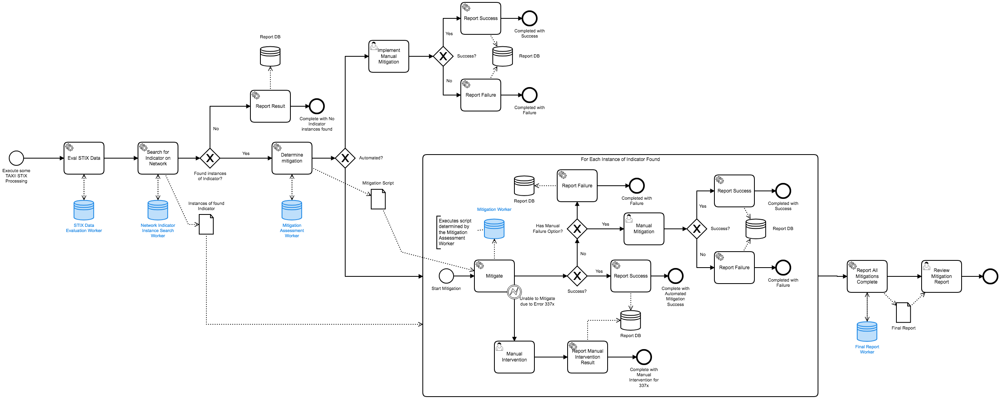

# TAXII-Worker

External Task Worker for TAXII-springboot-bpmn.

This is a generic task worker that can execute scripts in different polymorphic languages as determined by the execution env and worker configurations.
Scripts can be injected during runtime allowing a flexible architecture.

Example of a BPMN that would be executed on the TAXII-springboot-bpmn Server, and the worker(s) would Fetch and Lock, and then complete the work as orchestrated by Camunda.



Using External workers allow execution of TAXII and STIX data evaluations and actions to be done in any language.  
This worker acts as a universal bridge example allowing a unified worker framework to execute scripting in various polymorphic languages providing flexibility to downstream Cyber Analysts.

# Current Workflow Actions Supported

## Fetch and Lock

```java
FetchAndLock falConfig = FetchAndLock.builder()
    .addTopic(FetchAndLockTopic.builder()
            .topicName("mytopic")
            .build())
    .addTopic(FetchAndLockTopic.builder()
            .topicName("someOtherSimilarTopic")
            .build())
    .maxTasks(50)
    .usePriority(true)
    .workerId("central-worker")
    .build();

externalTaskService.fetchAndLock(falConfig).setHandler(result -> {
    if (result.succeeded()) {
        List<FetchAndLockResponseModel> tasks = result.result().getFetchedTasks();

        if (!tasks.isEmpty()) {
            future.complete();
            tasks.forEach(this::doSomeWork);
        } else {
            System.out.println("No tasks found");
            future.fail("No Tasks Found");
        }
    } else {
        System.out.println(result.cause().getMessage());
        future.fail(result.cause());
    }
});
```

## Complete

```java
externalTaskService.complete(completeModel).setHandler(completeResult -> {
            if (completeResult.succeeded()) {
                System.out.println(String.format("Task %s completed.", completeModel.getId()));
            } else {
                System.out.println(completeResult.cause().getMessage());
            }
        });
```

## Handle BPMN Error

```java
externalTaskService.handleBpmnError(handleBpmnErrorModel)
```

## Handle Failure

```java
externalTaskService.handleFailure(handleFailureModel)
```

All methods return a `Future<>` so you can implement the `.setHandler()` method to action when a result is returned by the async code:

```java
externalTaskService.complete(completeModel).setHandler(completeResult -> {
        if (completeResult.succeeded()) {
            System.out.println(String.format("Task %s completed.", completeModel.getId()));
        } else {
            System.out.println(completeResult.cause().getMessage());
        }
    });
```

As long as the Web Client was able to make a successful http connection, the Future will complete.
It is up to your implementations to evaluate if the Future was a success or failure.  In the case of a Failure, the returned `Throwable` will be a instance of CamundaErrorResponse.class.
The HTTP Status Code, the raw response body, and a in-code defined message are provided for context about what went wrong.

Example usage is, if you were using the fetchAndLock(), and camunda returned a status code other than 200, then you will get failed `Future`, as `200` is the defined status code for a successful request as per Camunda API spec docs.


# Example usage

Setup the Client:

```java
externalTaskService = new ExternalTaskService(vertx)
        .setBaseUrl("http://localhost:8081");
```

Creating a Fetch and Lock package for use by the Web Client:

```java
FetchAndLock falConfig = FetchAndLock.builder()
    .addTopic(FetchAndLockTopic.builder()
            .topicName("mytopic")
            .build())
    .addTopic(FetchAndLockTopic.builder()
            .topicName("someOtherSimilarTopic")
            .build())
    .maxTasks(50)
    .usePriority(true)
    .workerId("central-worker")
    .build();
```

and then you can use this a FetchAndLock object:

```java
externalTaskService.fetchAndLock(falConfig).setHandler(result -> {
    if (result.succeeded()) {
        List<FetchAndLockResponseModel> tasks = result.result().getFetchedTasks();

        if (!tasks.isEmpty()) {
            future.complete();
            tasks.forEach(this::doSomeWork);
        } else {
            System.out.println("No tasks found");
            future.fail("No Tasks Found");
        }
    } else {
        System.out.println(result.cause().getMessage());
        future.fail(result.cause());
    }
});
```

After doing your work in the doSomeWork() method, you can return the result:

```java
private void completeWork(CompleteModel completeModel) {
    externalTaskService.complete(completeModel).setHandler(completeResult -> {
        if (completeResult.succeeded()) {
            System.out.println(String.format("Task %s completed.", completeModel.getId()));
        } else {
            System.out.println(completeResult.cause().getMessage());
        }
    });
}
```

Each Camunda External task endpoint has a Immutable builder avaliable, and each response is returned in a Immutable Response.

Everything is type checked and validated with Bean Validation annotations.

# A circut breaker can be implemented using the ExternalTaskCircuitBreaker class:

```java

CircuitBreaker breaker = new ExternalTaskCircutBreaker(vertx, 2000L, null).getCircuitBreaker();

checkForTasks(breaker, falConfig);

private void checkForTasks(CircuitBreaker breaker, FetchAndLockModel fetchAndLockModel){
         breaker.execute(future -> {
            System.out.println("Attempting to Fetch and Lock Tasks... " + new Date().toString());

            externalTaskService.fetchAndLock(fetchAndLockModel).setHandler(result -> {
                if (result.succeeded()) {
                    List<FetchAndLockResponseModel> tasks = result.result().getFetchedTasks();

                    if (!tasks.isEmpty()) {
                        future.complete();
                        tasks.forEach(this::doSomeWork);
                    } else {
                        System.out.println("No tasks found");
                        future.fail("No Tasks Found");
                    }
                } else {
                    System.out.println(result.cause().getMessage());
                    future.fail(result.cause());
                }
            });
        });
    }

```

The breaker ~could~ be setup to provide automatic result such as (but not recommended usage as it is a bit hacky):

```java
CircuitBreaker breaker = new ExternalTaskCircutBreaker(vertx, 2000L, null).getCircuitBreaker();

checkForTasks(breaker, falConfig);
vertx.setPeriodic(5000, t->{
    System.out.println("Breaker state is: " + breaker.state().toString());
    if (breaker.state().equals(CircuitBreakerState.HALF_OPEN) || breaker.state().equals(CircuitBreakerState.OPEN)){
        System.out.println("Resetting breaker...");
        breaker.reset();

        checkForTasks(breaker,falConfig);
    }
});
```

# Larger scale usage

The usage of vertx should be that the Vertx Event Bus is leveraged to pass tasks around.  All the Immutables has been setup to be serializable as Json using vertx's jackson `Json.encode()`.

A verticle can be setup to collect tasks and send them to other verticles through the event bus to process the work.

This enables other verticles to not to have worry about Camunda specific information and details.

Further you could also have each verticle long poll or jitter poll camunda and process everything within the verticle it self.

The current thinking is that centralized polling with pushing the work to individual verticles through the event bus is optimial as it scales the best without having to increase the load of polling on the Camunda server.
